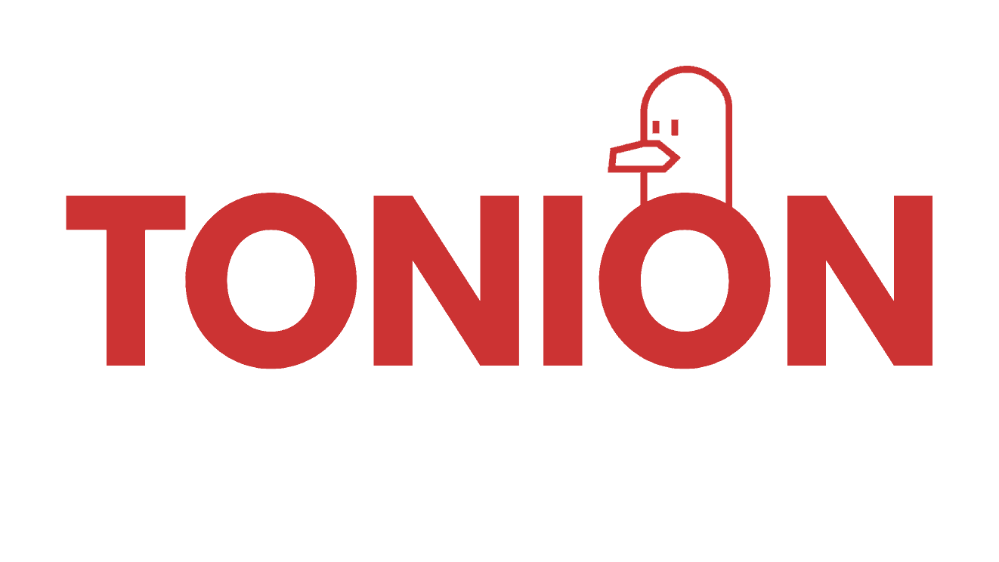

<p align="center">
    
</p>

<h1 align="center">
OpenGem Contracts
</h1>

<br/>

OpenGem Contracts is a secure and reusable smart contract library for the Tact language on the TON blockchain. OpenGem aims to provide reliable and efficient contract components to streamline the development of TON-based decentralized applications.

## Table of Contents

- [Installation](#installation)
- [Usage](#usage)
- [Scripts](#scripts)
- [Project Structure](#project-structure)
- [Contributing](#contributing)
- [Contributors](#contributors)
- [License](#license)

## Usage

add the `traits (contracts/traits)` to your project `contracts/imports`, then
Import the required contracts and traits in your Tact code:

```tact
import "./imports/traits/someCategory/SomeContract.tact";
```
We are working on a solution to use `npm` to install OpenGem Contracts and import them directly into your contracts without the need to copy the files manually. Additionally, we are exploring potential changes in Tact to support importing directly from GitHub or similar platforms.

## Libraries

```plaintext
├── access
│   └── ownableTransferable2Step
└── utils
    └── counter
```


## Scripts

- **Build All Contracts**: Compiles all the contracts in the library.
  ```sh
  npm run build:all
  ```

- **Run Tests**: Executes the test suite using Jest.
  ```sh
  npm test
  ```

## Project Structure

```plaintext
├── contracts
│   ├── traits
│   │   └── (trait categories)
│   │       └── (trait files)
│   └── mocks
│   │   └── (mock categories)
│   │       └── (mock files)
├── tests
│   ├── (test categories)
│   │       └── (test files)
│   └── main.spec.ts 
├── package.json
└── README.md
```


## Contributing

We welcome contributions from the community! If you'd like to contribute, please follow these steps:

1. Fork the repository.
2. Add feature or fix bug
3. Open a pull request.

## Contributors

- **Zig Balthazar** - [zigbalthazar@gmail.com](mailto:zigbalthazar@gmail.com)
- **Kayhan Alizadeh** - [kehiiiiya@gmail.com](mailto:kehiiiiya@gmail.com)

## License

This project is licensed under the MIT License - see the [MIT License](LICENSE) file for details.
